# EventHub - Cloud-Native DevOps Event Platform

EventHub is a production-style event booking platform built to demonstrate modern cloud-native delivery practices: microservices, containerization, Kubernetes, Helm, GitOps, CI/CD, infrastructure as code, security scanning, and observability.

The application models a complete event lifecycle: users register and authenticate, organizers create events, customers reserve seats, payments confirm bookings, tickets are issued as PDFs, notifications are processed asynchronously, and analytics provide operational insight.

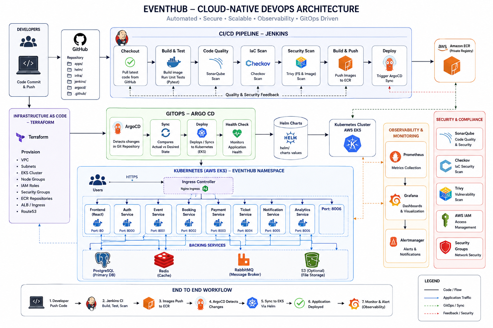

## Highlights

- Microservice backend built with Python FastAPI
- React frontend served as a containerized web application
- PostgreSQL for primary persistence
- Redis for booking expiry and cache-style coordination
- RabbitMQ for asynchronous payment, ticketing, and notification workflows
- Docker Compose for local development
- Kubernetes manifests and Helm chart for cluster deployment
- Terraform modules for AWS VPC, EKS, and ECR provisioning
- Jenkins pipeline for build, test, scan, image publish, and deployment verification
- Argo CD GitOps deployment with automated sync, pruning, and self-healing
- Prometheus, Grafana, and Alertmanager through kube-prometheus-stack
- SonarQube, Checkov, and Trivy security and quality gates

## Platform Architecture

EventHub is designed as a layered platform:

| Layer | Responsibility |
| --- | --- |
| Frontend | React/Vite client for login, registration, event management, checkout, tickets, and admin views |
| API services | Auth, event, booking, payment, ticket, notification, and analytics APIs |
| Async processing | RabbitMQ-backed workers for payment success, ticket generation, booking expiry, and notifications |
| Data layer | PostgreSQL, Redis, RabbitMQ, and optional S3-style file storage |
| Delivery | Jenkins CI/CD, Amazon ECR image registry, Helm, and Argo CD |
| Runtime | AWS EKS, NGINX ingress, Kubernetes services, deployments, secrets, and persistent volumes |
| Governance | SonarQube code quality, Checkov IaC scanning, Trivy filesystem and image scans |
| Observability | Prometheus metrics, Grafana dashboards, Alertmanager, and OpenTelemetry starter config |

## Application Services

| Service | Port | Description |
| --- | ---: | --- |
| `frontend` | `3000` local / `80` cluster | React web interface |
| `auth-service` | `8001` local / `8000` container | Registration, login, refresh tokens, user listing |
| `event-service` | `8002` local / `8000` container | Event creation, event search, reservations, organizer events |
| `booking-service` | `8003` local / `8000` container | Booking creation, lookup, confirmation, expiry |
| `payment-service` | `8004` local / `8000` container | Payment simulation and payment event publishing |
| `ticket-service` | `8005` local / `8000` container | Ticket issuing, ticket listing, PDF download |
| `notification-service` | `8006` local / `8000` container | Notification worker API and failed notification inspection |
| `analytics-service` | `8007` local / `8000` container | Admin and organizer analytics |

## User Journey

1. A user registers or logs in through the frontend.
2. An organizer creates an event with venue, location, time, capacity, and price.
3. A customer reserves a ticket through the booking flow.
4. Redis-backed expiry logic protects abandoned reservations.
5. Payment confirmation publishes events through RabbitMQ.
6. Ticket and notification workers process the downstream workflow.
7. Admin and organizer analytics expose platform activity.

### Frontend Preview

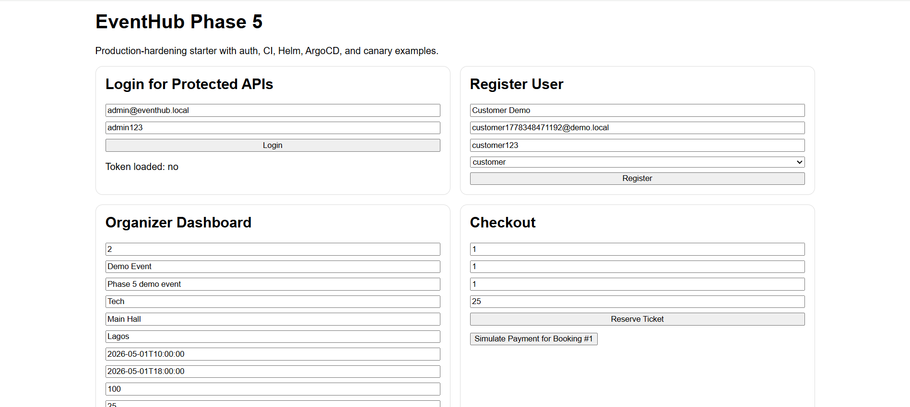

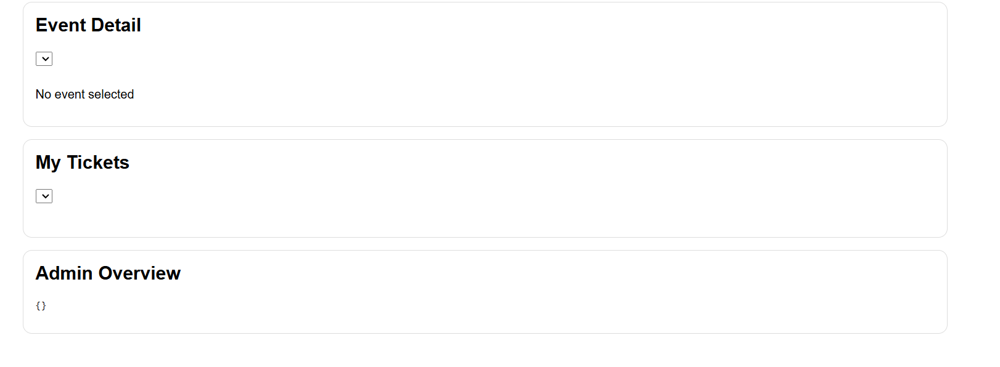

## Repository Layout

```text
.
|-- apps/                    # Frontend and FastAPI microservices
|-- docker-compose.yaml       # Local development stack
|-- gitops/                  # Argo CD application manifests
|-- helm/eventhub/           # Helm chart and environment values
|-- infra/                   # Terraform AWS infrastructure modules
|-- jenkins/Jenkinsfile       # Jenkins CI/CD pipeline
|-- k8s/                     # Raw Kubernetes manifests
|-- observability/           # OpenTelemetry and observability starter config
|-- scripts/                 # Utility scripts
|-- docs/                    # Runbooks, checklists, and README images
```

## Local Development

### Prerequisites

- Docker and Docker Compose
- Node.js, only if running the frontend outside Docker
- Python 3.11+, only if running services outside Docker

### Start the Full Stack

```bash
cp .env.example .env
docker compose up --build
```

The frontend will be available at:

```text
http://localhost:3000
```

Key local services:

```text
auth-service          http://localhost:8001
event-service         http://localhost:8002
booking-service       http://localhost:8003
payment-service       http://localhost:8004
ticket-service        http://localhost:8005
notification-service  http://localhost:8006
analytics-service     http://localhost:8007
RabbitMQ UI           http://localhost:15672
PostgreSQL            localhost:5432
Redis                 localhost:6379
```

### Seed Demo Data

```bash
docker compose exec auth-service python app/seed.py
docker compose exec event-service python app/seed.py
```

### Run Workers

Run workers in separate terminals when testing async flows locally:

```bash
docker compose exec booking-service python app/workers/expiry_worker.py
docker compose exec booking-service python app/workers/payment_success_worker.py
docker compose exec notification-service python app/workers/notification_worker.py
```

### Run Tests

```bash
docker compose exec auth-service pytest -q
docker compose exec event-service pytest -q
docker compose exec booking-service pytest -q
```

## CI/CD Pipeline

The Jenkins pipeline is defined in `jenkins/Jenkinsfile` and supports two modes:

- `ACTION=test`: build the local stack, run tests, and execute security and quality checks.
- `ACTION=deploy`: run the test workflow, push images to ECR, trigger Argo CD sync, and verify Kubernetes resources.

Pipeline stages:

1. Checkout source code
2. Create CI environment file
3. Create Docker Compose CI override
4. Clean existing local stack
5. Build local stack
6. Run Pytest
7. Run Checkov IaC scan
8. Run SonarQube code scan
9. Run Trivy filesystem scan
10. Login to Amazon ECR
11. Build and push service images
12. Run Trivy image scan
13. Trigger Argo CD sync
14. Verify Kubernetes deployment
15. Archive scan reports and clean up

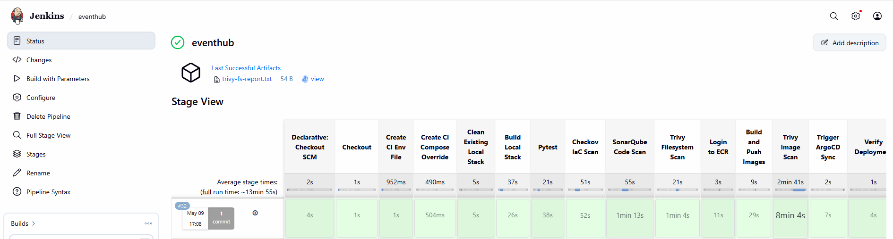

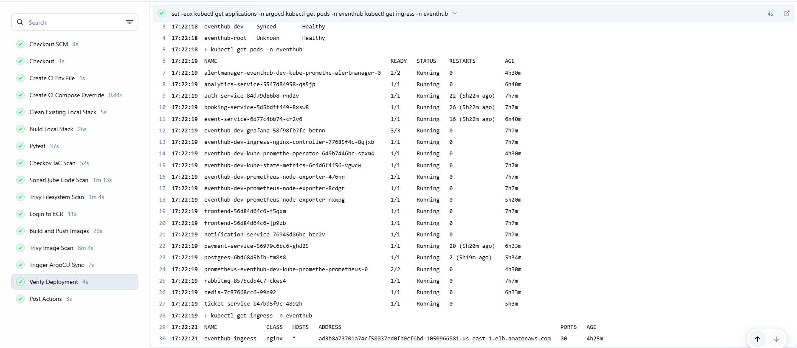

### Required Jenkins Credentials

| Credential ID | Purpose |
| --- | --- |
| `sonarqube-token` | Authenticates SonarQube scan |
| `aws-access-key-id` | AWS access key for ECR, EKS, and deployment verification |
| `aws-secret-access-key` | AWS secret key for ECR, EKS, and deployment verification |

## Security and Quality

EventHub includes quality and security checks across application code, containers, Kubernetes, Helm, and Terraform:

| Tool | Coverage |
| --- | --- |
| SonarQube | Code quality, reliability, maintainability, and security review |
| Checkov | Terraform, Kubernetes, and Helm infrastructure scanning |
| Trivy FS | Filesystem vulnerability, secret, and misconfiguration scan |
| Trivy Image | Container image vulnerability scan after images are built and pushed |

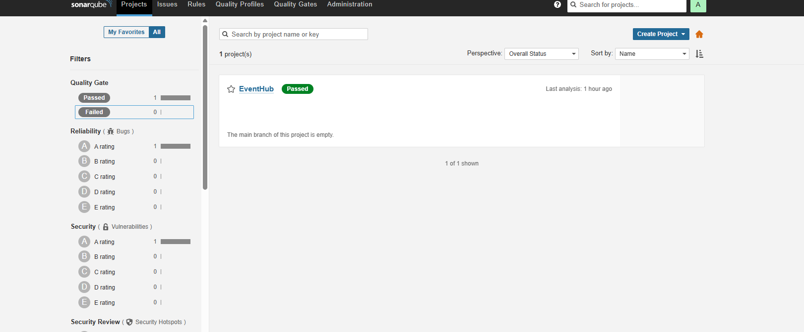

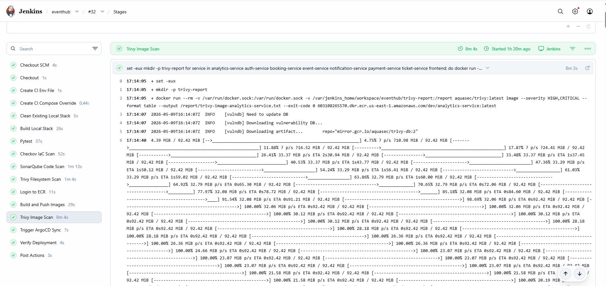

## GitOps Deployment

Argo CD manages the application from the Git repository using the Helm chart in `helm/eventhub`.

The dev application is defined in:

```text
gitops/apps/eventhub-dev.yaml
```

It deploys:

- Source path: `helm/eventhub`
- Values file: `values-dev.yaml`
- Destination namespace: `eventhub`
- Automated sync: enabled
- Prune: enabled
- Self-heal: enabled

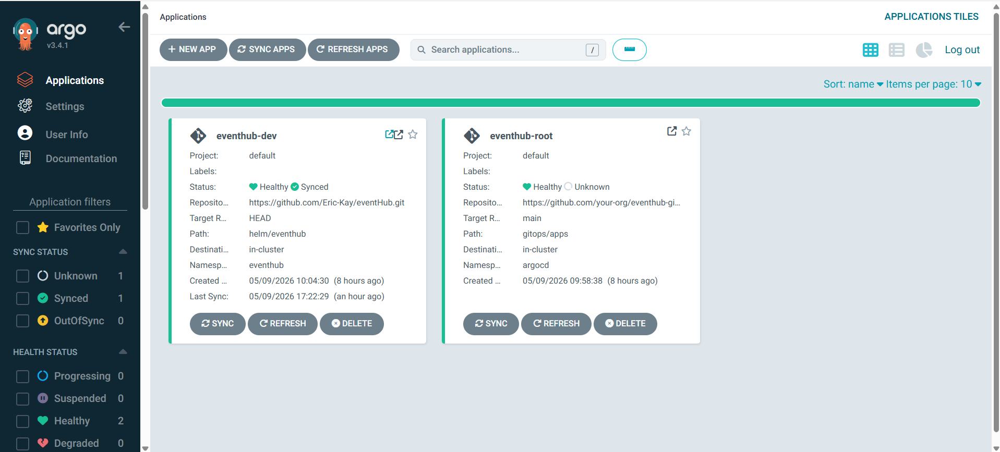

## Kubernetes and Helm

The Helm chart packages the platform for Kubernetes deployment:

```text
helm/eventhub
```

Included chart dependencies:

- `ingress-nginx`
- `kube-prometheus-stack`

Development values enable:

- NGINX ingress controller with LoadBalancer service
- Grafana
- Prometheus
- Alertmanager
- EventHub namespace deployment
- ECR image registry values

Install or upgrade manually:

```bash
helm dependency update helm/eventhub
helm upgrade --install eventhub helm/eventhub \
  --namespace eventhub \
  --create-namespace \
  -f helm/eventhub/values-dev.yaml
```

Verify the deployment:

```bash
kubectl get pods -n eventhub
kubectl get ingress -n eventhub
kubectl get svc -n eventhub
```

## AWS Infrastructure

Terraform code in `infra/` provisions the cloud foundation:

- VPC
- Public and private subnets
- EKS cluster
- EKS managed node groups
- IAM roles
- Security groups
- ECR repositories for all application images
- S3/DynamoDB backend for Terraform state and locking

Development environment entry point:

```text
infra/environments/dev
```

Typical workflow:

```bash
cd infra/environments/dev
terraform init
terraform plan
terraform apply
```

## Observability

EventHub includes a Kubernetes observability stack through `kube-prometheus-stack`:

- Prometheus for metrics collection
- Grafana for dashboards and visualization
- Alertmanager for alert routing
- OpenTelemetry collector starter config in `observability/`
- Service `/health` endpoints across all APIs
- Metrics starter endpoints on selected services

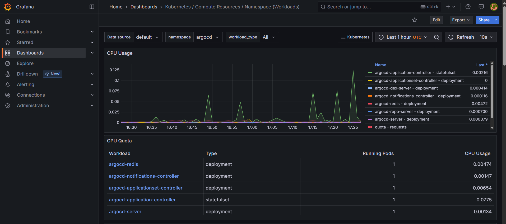

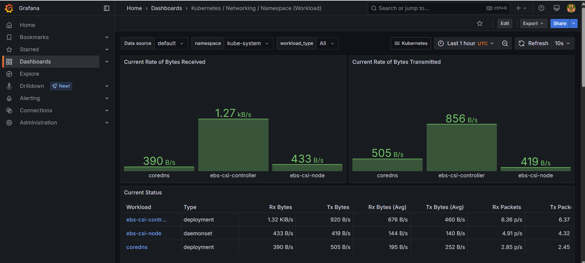

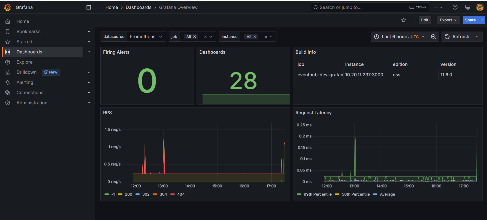

## Production Runbook

Operational notes are maintained in:

- `docs/production-runbook.md`
- `docs/final-checklist.md`

The production runbook covers:

- Pre-deploy checks
- Deployment verification
- Rollback actions
- Post-deploy smoke tests
- Worker, queue, database, ingress, and metrics checks

## Environment Configuration

Local configuration starts from:

```bash
cp .env.example .env
```

Core variables:

```text
POSTGRES_DB
POSTGRES_USER
POSTGRES_PASSWORD
POSTGRES_HOST
POSTGRES_PORT
REDIS_HOST
REDIS_PORT
RABBITMQ_HOST
RABBITMQ_PORT
RABBITMQ_USER
RABBITMQ_PASSWORD
```

Do not commit production secrets. Use Kubernetes Secrets, external secret management, or your cloud secret manager for real deployments.

## API Health Checks

Every backend service exposes a health endpoint:

```text
GET /health
```

Example local check:

```bash
curl http://localhost:8001/health
curl http://localhost:8002/health
curl http://localhost:8003/health
```

## Current Status

EventHub is a portfolio-grade, production-hardening starter platform. It demonstrates how a distributed event booking system can be built, tested, scanned, deployed, observed, and operated with a cloud-native DevOps workflow.

Recommended next hardening steps:

- Replace demo credentials with managed secrets
- Add TLS and production ingress hostnames
- Add database backup and restore automation
- Expand service-level tests and contract tests
- Add migration execution to the deployment workflow
- Add structured logging and distributed tracing dashboards
- Promote immutable image tags instead of `latest`
- Add alert rules for API availability, queue depth, pod restarts, and latency

